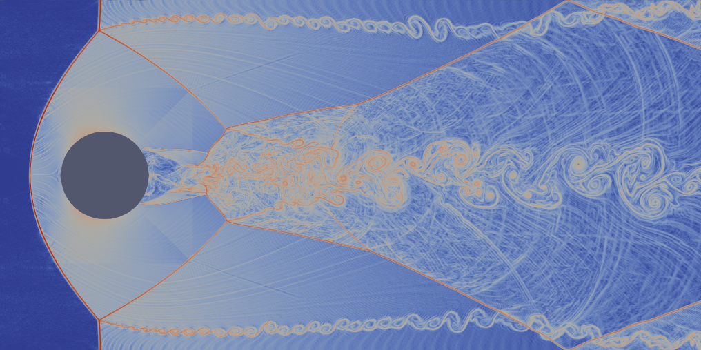
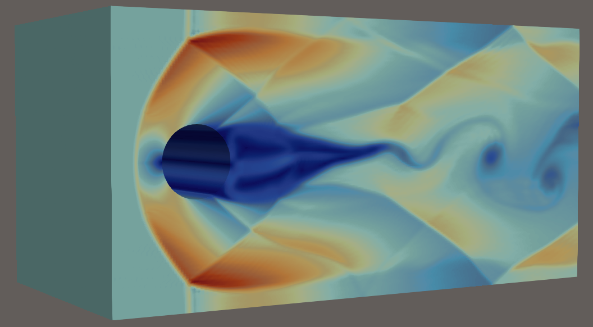

<div align="center">
<pre>
██████╗ ██████╗  █████╗  ██████╗  ██████╗ ███╗   ██╗
██╔══██╗██╔══██╗██╔══██╗██╔════╝ ██╔═══██╗████╗  ██║
██║  ██║██████╔╝███████║██║  ███╗██║   ██║██╔██╗ ██║
██║  ██║██╔══██╗██╔══██║██║   ██║██║   ██║██║╚██╗██║
██████╔╝██║  ██║██║  ██║╚██████╔╝╚██████╔╝██║ ╚████║
╚═════╝ ╚═╝  ╚═╝╚═╝  ╚═╝ ╚═════╝  ╚═════╝ ╚═╝  ╚═══╝
</pre>
</div>

# DRAGON - an experimental CUDA port of the solver ryujin - in development

## Description
This project is a CUDA port of the solver ryujin (https://github.com/conservation-laws/ryujin).
It is not a fork as many parts of the original code have been entirely rewritten for CUDA, and it is not an official contribution.

## Key Concepts
The approach followed here is to transfer the entire computation on the GPU to offer maximal speed.

## Remarks
- Only the Euler equations are implemented  
- Euler Mach3 cylinder cases in 2d and 3d have been tested  
- Single GPU computation
- Except for the generation of output files, libraries OpenMP, MPI and SIMD have been removed, as all computations are done on the GPU

## Supported OS
Tested on Ubuntu 24.04

## Prerequisites
Tested with a Nvidia RTX 4000 generation card

## Build and run

### Build with:
```bash
cd build/
cmake ..
make
```

### Then run with:
```bash
./euler_cuda
```

### These are extracts of transcient simulations of the test cases Euler cylinder Mach3, resp. in 2d and 3d:


